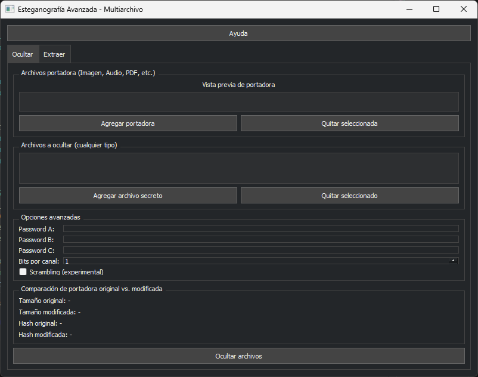
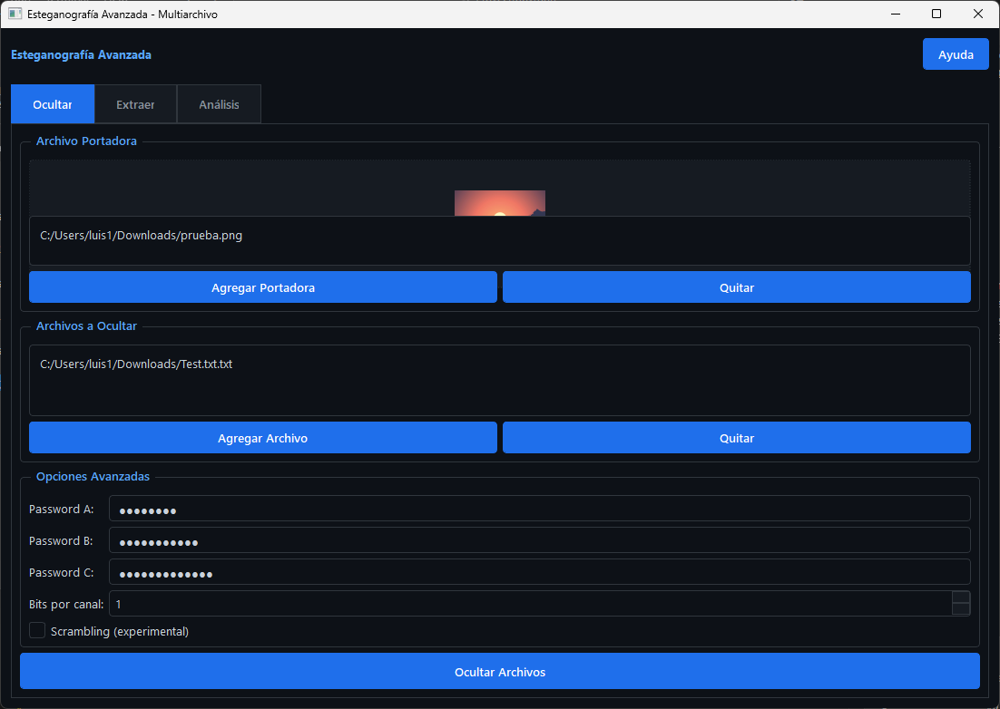

# Esteganografía Avanzada



**Oculta archivos de cualquier tipo en imágenes, audio y PDF con cifrado y una interfaz profesional. Incluye análisis visual y comparación avanzada.**


## 🚀 Características principales


- Oculta y extrae archivos de cualquier tipo en portadoras: imágenes (PNG/JPG/BMP), audio (WAV/MP3), PDF, ZIP y DOCX.
- Cifrado avanzado opcional de archivos secretos (Fernet/AES, seleccionable).
- Interfaz gráfica avanzada (PyQt5):
    - Modo oscuro profesional y temas personalizables
    - Drag & Drop global, tooltips y ayuda contextual
    - Vista previa avanzada y comparación de hashes/tamaños
    - Pestaña de análisis visual: selecciona y compara archivos, previsualiza imágenes/audio/pdf, compara tamaño y hash
    - Selección guiada de archivos: 
        - Al ocultar, los archivos modificados se guardan automáticamente en subcarpetas únicas dentro de `salidas_steg/` (por fecha y hora)
        - Al extraer, la selección de portadora abre directamente la carpeta de salidas
        - Al comparar, la selección de modificado abre la carpeta de salidas y la de original abre Descargas
    - Soporte multiarchivo y multiportadora
    - Historial de operaciones persistente y limpiable
    - Internacionalización (Español/Inglés)
- Integración con MongoDB:
    - Todas las operaciones, portadoras, archivos ocultos y errores se guardan automáticamente en la base de datos para auditoría y consulta
- Soporte multiplataforma (Windows/Linux/Mac)
- CLI para automatización y scripts

## 📸 Capturas de pantalla

### Interfaz principal (modo oscuro, pestañas y ayuda)



### Pestaña de Análisis: comparación visual y de hashes


## 📦 Estructura del proyecto

- `src/` — Código fuente principal
- `tests/` — Pruebas unitarias y de integración
- `image/` — Capturas y recursos visuales
- `data/` — Archivos de ejemplo para pruebas
- `docs/` — Documentación técnica y de usuario
- `scripts/` — Utilidades y scripts auxiliares

## ⚙️ Requisitos

- Python 3.12 (recomendado usar entorno conda)
- Instalar dependencias:

```bash
    conda env create -f environment.yml
    conda activate estegano
    # o
    pip install -r requirements.txt
    ```

## 🖥️ Uso rápido

1. Ejecuta la interfaz gráfica:

```bash
python src/steganografia/gui_advanced.py
```

2. Usa la pestaña "Ocultar" para seleccionar portadora y archivos secretos.
3. Usa la pestaña "Extraer" para recuperar archivos ocultos.
4. Usa la pestaña "Análisis" para comparar visualmente archivos, ver hashes y diferencias.

## 📝 Licencia

MIT. Libre para uso académico y profesional.

---
**Desarrollado por KikeGonRam.**
