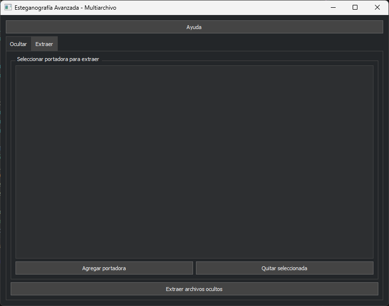

# Esteganografía Avanzada
**Oculta archivos de cualquier tipo en imágenes, audio y PDF con cifrado y una interfaz profesional.**


## 🚀 Características principales

	- Oculta y extrae archivos de cualquier tipo en portadoras: imágenes (PNG/JPG/BMP), audio (WAV/MP3) y PDF.
	- Cifrado opcional de archivos secretos (Fernet/AES).
	- Interfaz gráfica avanzada (PyQt5):
		- Modo oscuro profesional
		- Drag & Drop, tooltips y ayuda contextual
		- Vista previa y comparación de hashes/tamaños
	- Soporte multiplataforma (Windows/Linux/Mac)
	- CLI para automatización y scripts


## 📸 Capturas de pantalla


## 📦 Estructura del proyecto
	- `src/` — Código fuente principal
	- `tests/` — Pruebas unitarias y de integración
	- `image/` — Capturas y recursos visuales
	- `data/` — Archivos de ejemplo para pruebas
	- `docs/` — Documentación técnica y de usuario
	- `scripts/` — Utilidades y scripts auxiliares


## ⚙️ Requisitos
	- Python 3.12 (recomendado usar entorno conda)
	- Instalar dependencias:

```bash
conda env create -f environment.yml
conda activate estegano
# o
pip install -r requirements.txt
```


## 🖥️ Uso rápido
1. Ejecuta la interfaz gráfica:

	```bash
	python src/steganografia/gui_advanced.py
	```
2. Usa la pestaña "Ocultar" para seleccionar portadora y archivos secretos.
3. Usa la pestaña "Extraer" para recuperar archivos ocultos.


## 📝 Licencia
MIT. Libre para uso académico y profesional.

---
**Desarrollado por KikeGonRam y colaboradores.**
